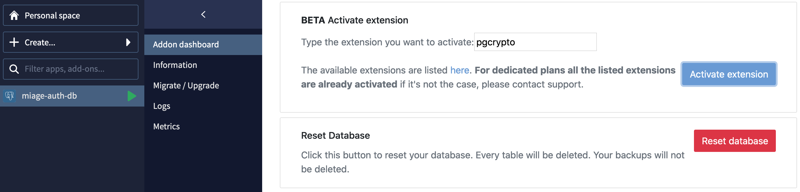

# About the solution 

## An entities overview

We will use a PosgreSQL to store our datas. 

> Task 1: create a `dbauth` database on local or with a free addon on Clever Cloud

We need a `Member` table to store our members. Nothing tricky about you should be accurate of this kind of table:

```sql
CREATE EXTENSION IF NOT EXISTS "pgcrypto";

CREATE TABLE "Member"
(
    id UUID PRIMARY KEY NOT NULL DEFAULT gen_random_uuid(),
    email TEXT NOT NULL UNIQUE,
    hash TEXT NOT NULL,
    username TEXT
)
```

> We never store passwords in a database, only hashes of passwords

If you are using Clever Cloud to create your database, you need to activate the extension through the admin console:



## A solution overview

The solution will expose services as a REST/JSON API. 

We will use thoose main modules:
- `Auth.Domain` (lib/domain.ml) will contain the modules that modelize the core of our application
- `Auth.Repository` (lib/repository.ml) will contain data repository of our application
- `Auth.Service` (lib/service.ml) will contain the business services of our application
- `Auth.Infra` (lib/infra.ml) will contain the communication with the infrastructure
- `Auth.Api` (lib/api.ml) will contain binding of dependencies and routing description
- `Server` (bin/server.ml) will glue all components together to build miage-auth binary, it's our REST server


## Environment variables

see [lib/infra.ml](../lib/infra.ml)

## API

### POST /signup

- summary: Register a new member to the platform
- parameters: body/json
    - email: string
    - password: string


### POST /signin

- summary: Generate a valid JWT against email / password strategy
- parameters: body/json
    - email: string
    - password: string

### POST /verify

- summary: Verify the validity of a JWT
- parameters: body/json
    - jwt: string